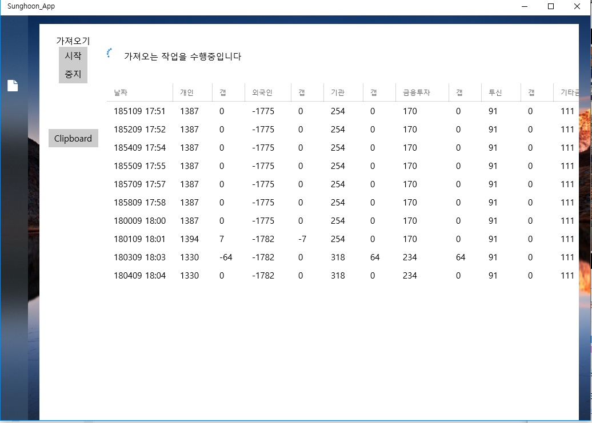

## 특정사이트 긁어오기 in UWP

* get HTML source and Parse with **HTMLAgilityPack**, `xPath syntax`
* periodically work with Dispatcher in .NET  
* mvvm in UWP
* DataGrid and data bind

## Overview

#### 1 Final App image

#### 2 unresolved, remaining problem
1 `INotifyPropertyChanged` and `ObservableCollection<T>`  
> I couldn't bind data on datagrid with Item change event.  

2 process of saving data in structured shape was not implemented
> At this moment, I think it is not important now.

3 more simpler, nice design would be better ; 
> not good at xaml design... ㅠㅠ

